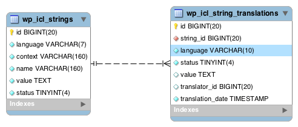

# genexus blog

1. Es necesario tener instalado y activado el plugin **Advanced Custom Fields (ACF)**, de lo contrario va a generar un error que va a impedir que se ejecute javascript.

---

##WPML Setup

1. **Languages**:
   Seleccionar "English" como default langauge, y luego "Spanish" y "Portuguese" como "Translation languages".
2. **URL Format**:
   Seleccionar el primero "Different languages in directories"
3. **Register WPML**:
   Key para desarrollo: UZESDUGWA4
4. **Translation Mode**:
   - Elegir "Translate what you choose"
   - Elegir luego "Users of this site" y asignar a los traductores.
5. **Support**:
   Seleccionar "yes, send theme and plugins information..."
6. **Plugins**:
   Seleccionar "String Translation"
7. **Finish**

### Siguientes pasos:

1. **Translation Management**:
   - Seleccionar "Translate" para todos los idiomas
   - Seleccionar "Translate myself"
2. **WPML > Settings > Custom Fields Translation**:
   Seleccionar "Don't translate" para los campos de ACF.
3. **WPML > String Translation**:
   - Si lo anterior no funciona, eliminar las strings de acf, ya que no queremos traducirlas.
4. **Translation Priority**: Configurar esta opción como "Not translatable" en WPML > Settings > Taxonomies Translation, para que el combo "
5. **Traducción de Taxonomías (categoría y tags)**:
   Usar la traducción de taxonomías de WPML: WPML > Taxonomy translation, ya que si se hace directamente desde, por ejemplo una categoría, va a haber que asignar todos los valores (color, bg-color, iconos, etc) para cada idioma.

---

##WPML (links de interés)
[WPML reset](https://wpml.org/documentation/getting-started-guide/language-setup/deleting-languages-and-plugin-data-by-doing-a-wpml-reset-on-your-site/)
[Advanced Translation Editor](https://wpml.org/documentation/translating-your-contents/using-the-translation-editor/switching-from-classic-to-advanced-translation-editor/)
[Migration](https://wpml.org/documentation/translating-your-contents/advanced-translation-editor/using-advanced-translation-editor-when-you-move-or-use-a-copy-of-your-site/)
[Tables schema](https://wpml.org/documentation/support/wpml-tables/)
[wpml export/import](https://wpml.org/documentation/related-projects/wpml-all-import-plugin-website-import-with-wpml/)
[calculate estimated automatic translation](https://wpml.org/forums/topic/how-to-adjust-character-amount-per-website/)
[delete translated options](https://wpml.org/documentation/translating-your-contents/adding-priority-to-your-translations/#how-to-add-priority-to-any-translation)

- La tabla que contiene la información de la traducción es **`icl_translations`**. Las tablas relacionadas a **`icl_translations`** son:
  - **`wp_comments`**
  - **`wp_term_taxonomy`**
  - **`wp_terms`**
  - **`wp_posts`**
  - **`wp_icl_translation_status`**

###WPML icl_translations

- Cada elemento de contenido del sitio configurado como traducible (publicación, página, etiqueta, categoría, tipo de publicación personalizado y taxonomías personalizadas) tiene una entrada en esta tabla.
- Las entradas del mismo grupo de traducción comparten el mismo valor en las columnas element_type y trid.
  - **`translation_id`**: serial number. Es el id que identifica a la traducción.
  - **`element_type`**: El tipo de elemento (post, category, attachment, etc).
  - **`element_id`**: El ID del elemento (post_id para tipos de publicaciones, term_taxonomy_id para términos de taxonomía). Una traducción se considera un post distinto. Es decir, para un post que se tradujo en dos idiomas, existirán 3 posts independientes. Cuando Se inicializó una traducción de un post, pero está incompleta, el `element_id` será `null`.
  - **`trid`**: El id del grupo de traducción. Es lo que nos permite identificar los elementos relacionados. Por ejemplo, un post original y sus posts traducidos, compartirán el mismo `trid`.
  - **`language_code`**: el código de lenguaje del ítem.
  - **`source_language_code`**: si está traducido, el código de lenguaje del ítem original.

### WPML (string translation)

La mayoría de los sitios de WordPress incluyen algunas cadenas que no pertenecen a ningún elemento (publicación, página, etiqueta, categoría) pero que aún así necesitan ser traducidas, por ejemplo, el lema del blog.

WPML incluye un mecanismo llamado "string translation", para manejar estas cadenas. Estas cadenas se guardan en la tabla **`icl_strings`**, y la traducción de estas cadenas se guarda en la tabla **`icl_string_translations`**.

### WPML (otros)

- **Traducción pendiente**: Se muestra un ícono de +.
- **Traducción incompleta**: Se muestra un ícono de una tuerca.
- **Traducción completa**: Se muestra un ícono de un lápiz.

### WPML Advanced Editor

- Permite ver el idioma original
- Permite la traducción automática
- Asegura la consistencia del formato (sólo es traducción de contenido)
- [Traducción automática en bulk](https://wpml.org/documentation/automatic-translation/automatically-translating-multiple-translation-jobs-in-bulk/)
- Mantiuene el slug original en inglés

---

##Preguntas WPML

- Cómo ocultar "Translation Priority", y, si no se puede como configurar que sea siempre obligatoria, y que aparezca en inlgés.

### PhpMyAmdin

- cotejamiento: latin1_swedish_ci
